**SWP新闻管理系统后台及注册登录部分**
* 一、运行环境
    * tomcat9.0 mysql8.0 windows10 浏览器推荐采用chrome浏览器 
* 二、开发语言
    * 1 Java(JDBC部分采用druid连接池，连接池登录名admin，密码123456)
    * 2 JavaScript(主要是jQuery)
    * 3 标记语言HTML5、CSS
    * 4 引用模板bootstrap、LayUI、bootstrap表单验证插件
    * 5 API地址：https://www.mxnzp.com/api  MyAPP： app_id=sngmqkqxuln6jkik app_secret=RVV0aDBJbnpIa2k3REdVQmNuaWI2dz09
* 三、主要功能实现
    * 1 验证码功能三种实现风格
        * 加减法验证
        * 调用API
        * 后台生成
    * 2 用户管理全部是Ajax局部刷新
    * 3 新闻管理全部是Ajax局部刷新
    * 4 新闻发布两种实现方式 
        * 普通新闻发布，可上传图片。需要手动添加新闻。
        * 快捷新闻发布，可上传图片。调用API，采用newsID一键发布新闻。
    * 5 用户登录状态验证，采用session，过滤器过滤。用户退出销毁session。
    * 6 用户登录名获取，采用cookie，登录成功将用户名写入cookie，js获取cookie值后ajax请求填充个人信息。
* 四、效果演示
    * 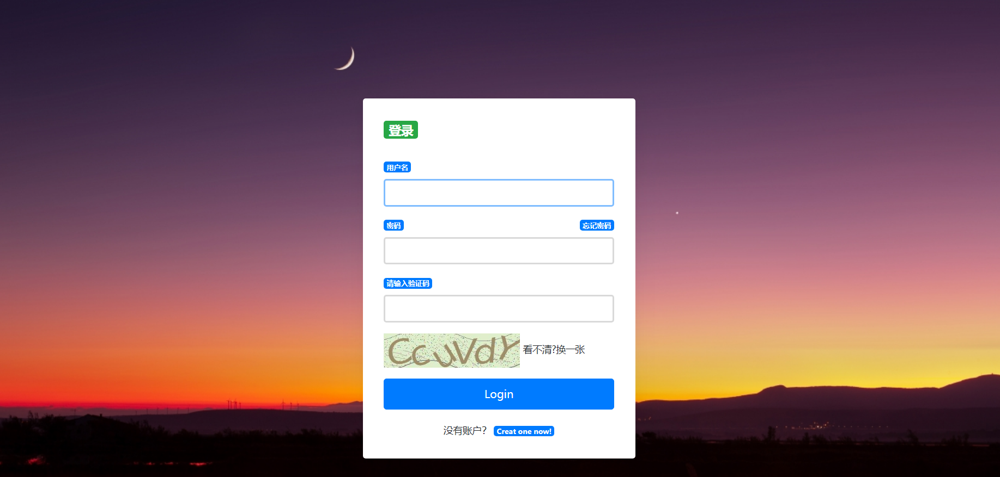
    * 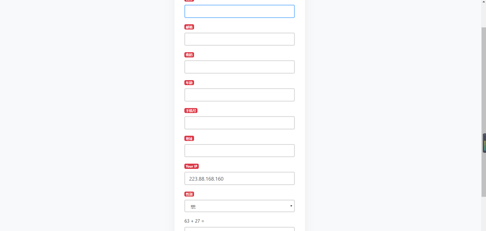
    * 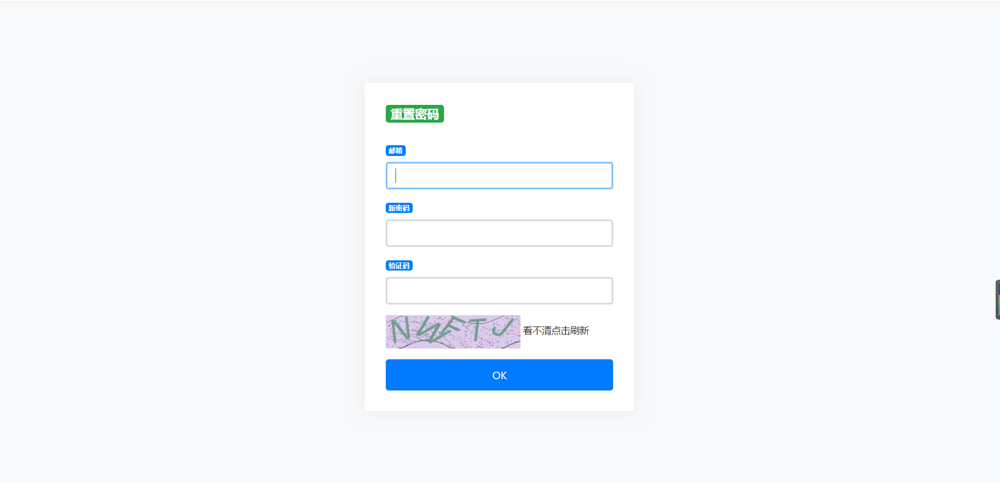
    * 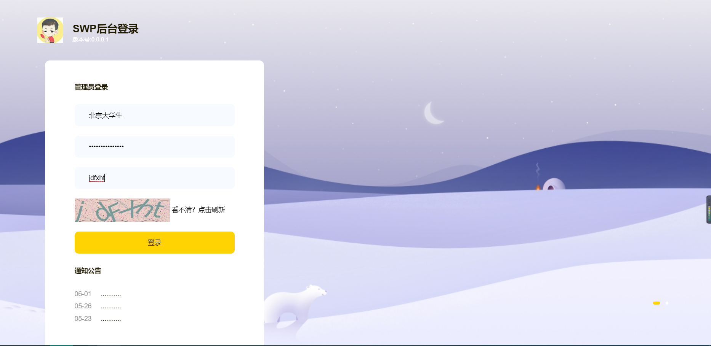
    * 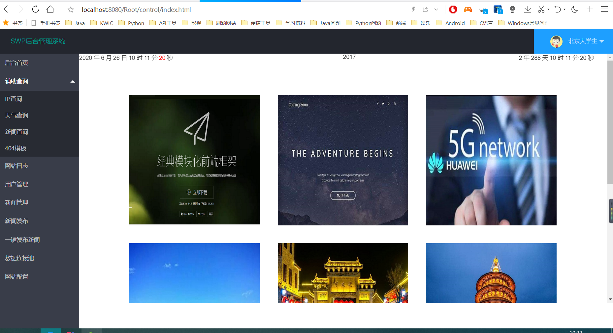  
    * 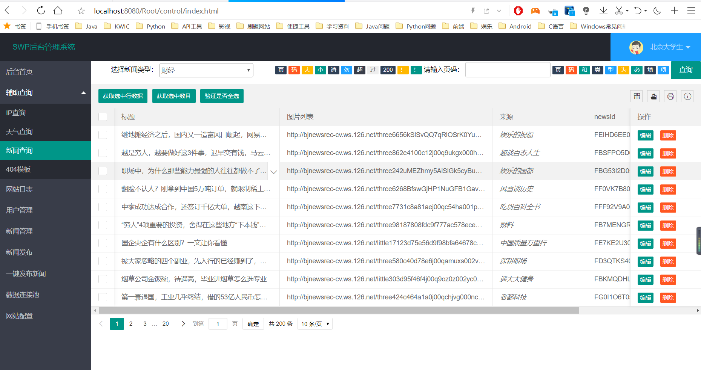
    * 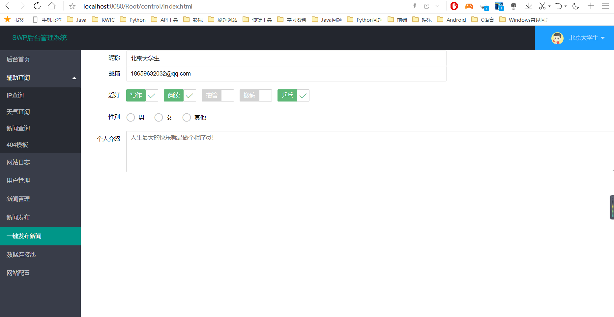
    * 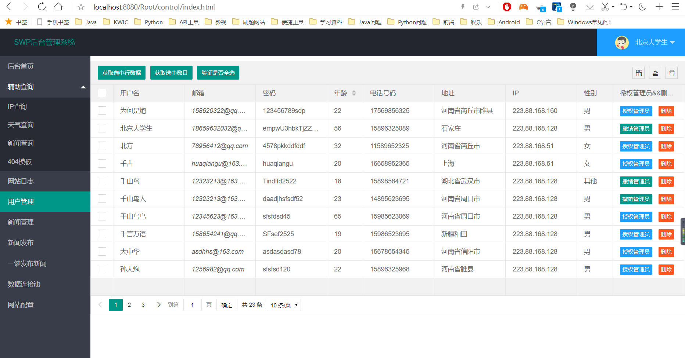
    * 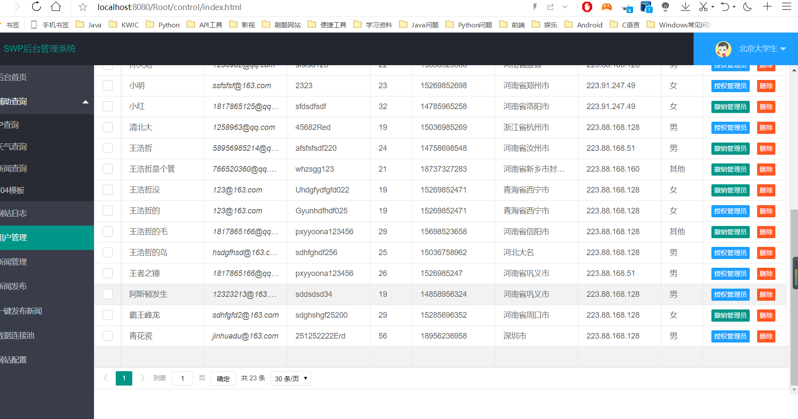
    * 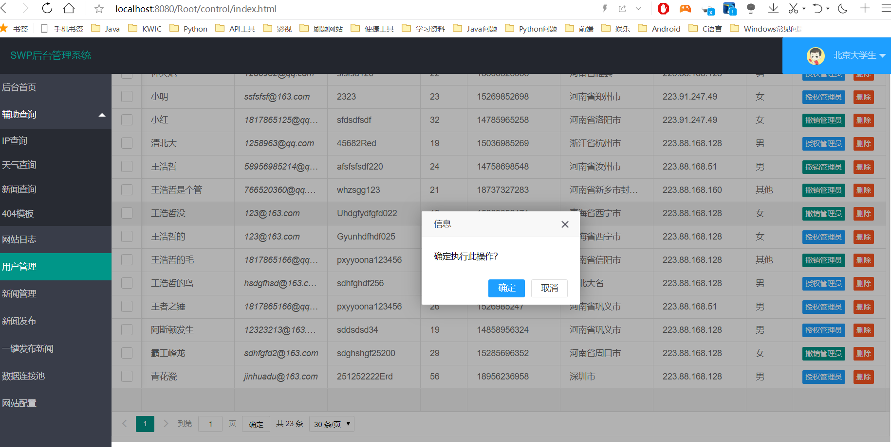
    * 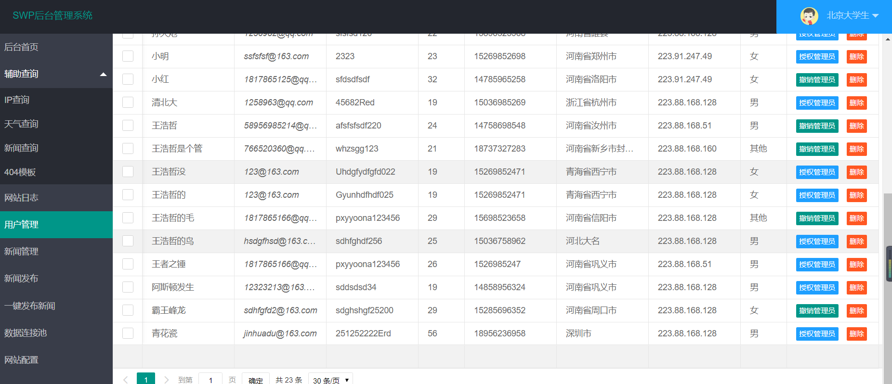
    * 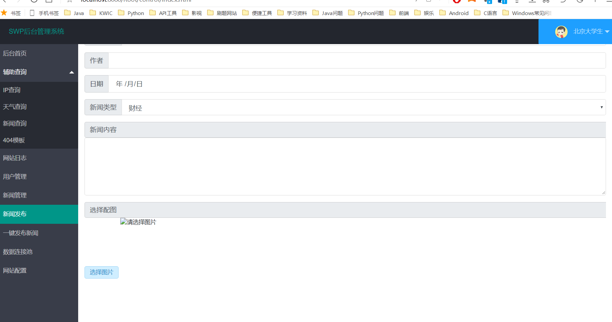
    * 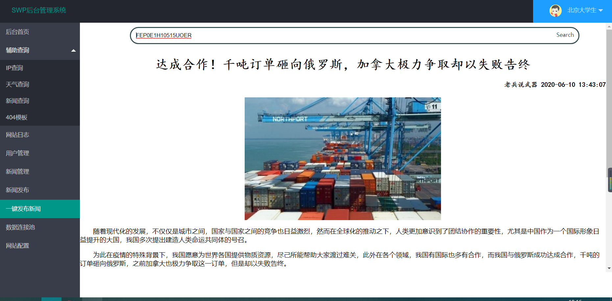
    * 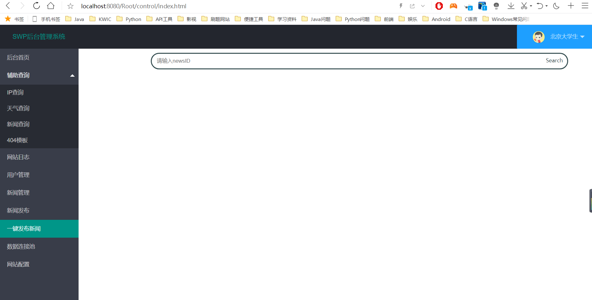
    * 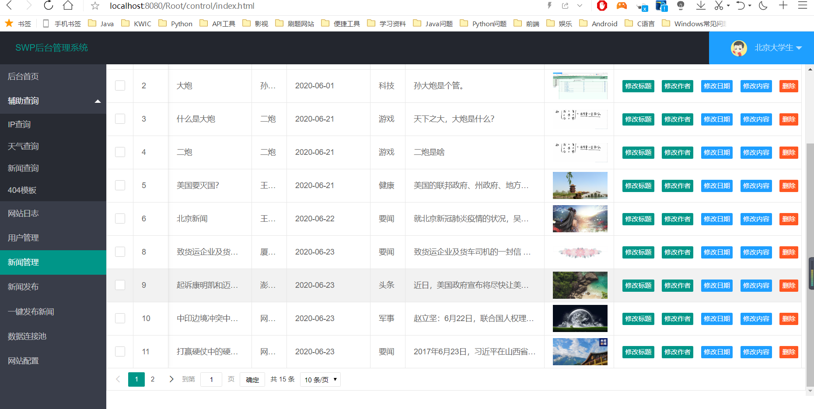
    * 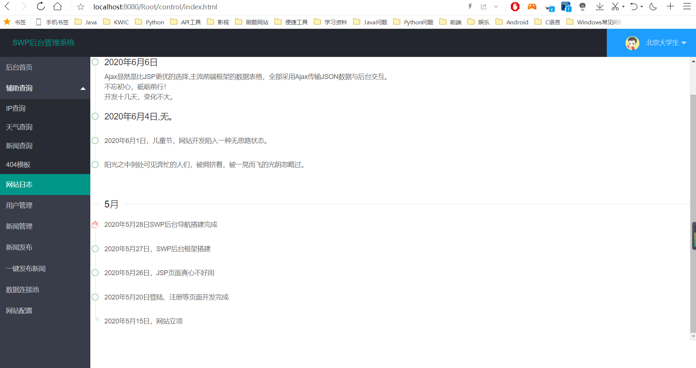
    * 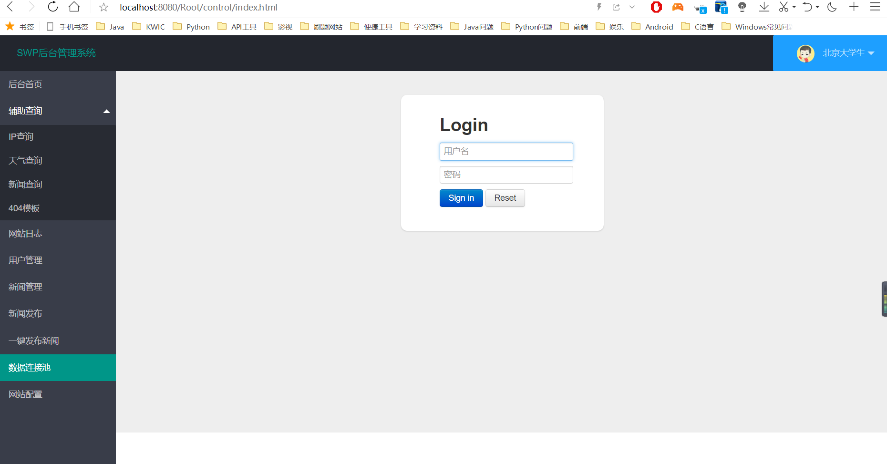
    * 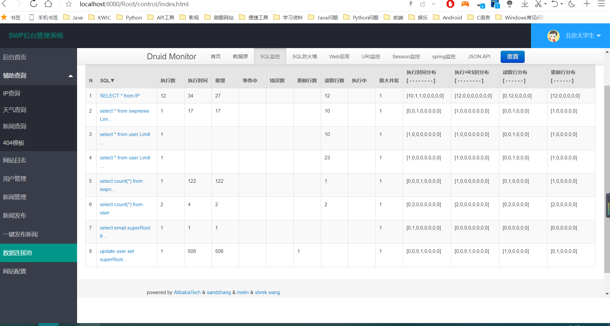
    * 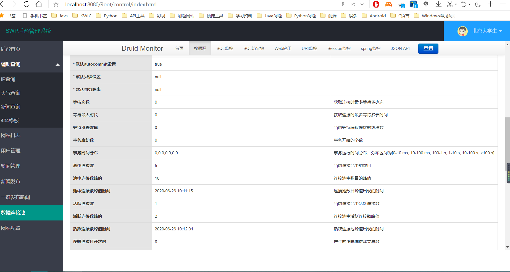
    * 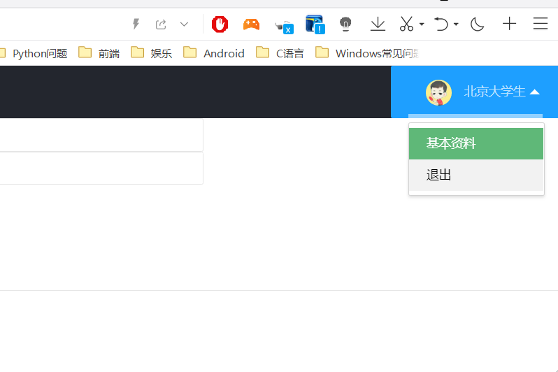
* 五、写在最后
    * 做一件事，要认真！  